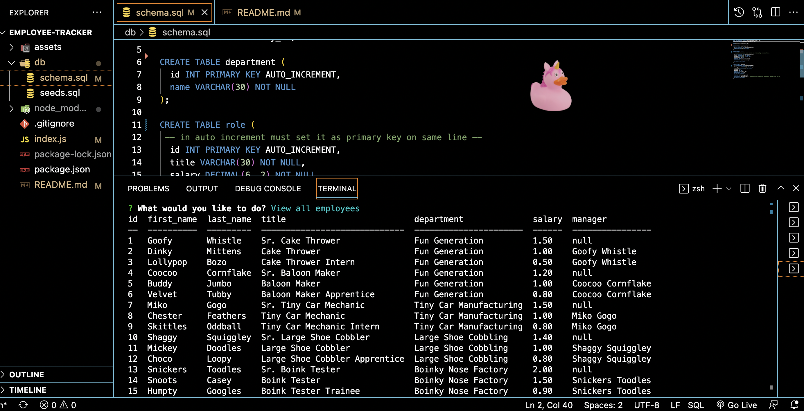

# Harold's Clown Factory Employee Tracker 🤡

  
  ## Table of Contents
  
   
  - i. [Description](#description)
  - ii. [General Information](#general-information)
    - i. [Installation](#installation)
    - ii. [Usage](#usage)
  - iii. [Screenshot and Demo Video](#screenshot-and-demo-video)
  - iv. [Acknowledgements](#acknowledgements)

  ## Description
  
  An application that tracks employees that work for Harold's Clown Factory using Inquirer and SQL.

  ## General Information
  
  ### Installation
  
  To install the necessary dependencies, run the following command:
  
  ```npm i ```

  ### Usage 

  This application uses inquirer, mysql2, and console.table as dependencies. Because they are in the package.json file, no additional action is necessary to download these dependencies. 


## Screenshot and Demo Video



[Link to Demo Video here](https://watch.screencastify.com/v/VR7g7D8ZPI1qzDN8yqTt)

## Acknowledgements

Special thanks to tutor Matthew Calimbas for introducing me to the console.table dependency which nicely formats the output tables in SQL. 
  
Thank you also to my classmate Adam [(GitHub linked here)](https://github.com/Variegatedhuman) who helped debug my schema.sql (it was a comma throwing the error).
  
